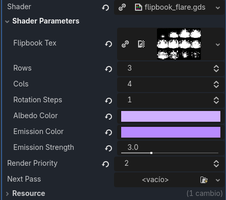

# Flipbook Particle Shader — Technical Overview

This document explains the behavior, purpose, and parameters of a custom Godot **spatial GPU shader** designed for **flipbook‑animated particle sprites**. It focuses on what the shader achieves, how it operates internally, and how each parameter influences the final visual result.

[View Shader Code](flipbook_flare.gdshader)

---

## What This Shader Does

This shader is built for **animated particle sprites** using a flipbook texture. It:

- **Plays a flipbook over the particle’s lifetime**, syncing animation to birth → death.
- **Supports configurable grid layouts** (`rows × cols`) for any flipbook atlas.
- **Allows 90° step rotation** (`rotation_steps`) to reuse the same flipbook in multiple orientations.
- **Tints albedo and emission**, enabling color grading and glow control.
- **Uses particle color/alpha curves** (`COLOR.r`) for fade‑in/out and intensity shaping.

The result is a clean, efficient system for **explosions, smoke, muzzle flashes, magical bursts, stylized impacts, and any time‑based sprite animation**.

---

## How the Shader Works (Conceptual Breakdown)

### 1. Lifetime‑Driven Animation

Each particle has a **normalized lifetime** value (0 → 1).  
The shader:

- Reads `INSTANCE_CUSTOM.w` in the vertex stage.
- Passes it to the fragment stage via `life_ratio_v`.
- Uses it to select the correct flipbook frame.

This ensures the animation **always plays from frame 0 to the last frame** over the particle’s lifetime.

---

### 2. Flipbook Grid & Frame Indexing

The flipbook texture is treated as a **uniform grid**:

- `rows` → number of frames vertically  
- `cols` → number of frames horizontally  
- `total_frames = rows * cols`

The shader converts lifetime into a frame index:

1. Clamp lifetime to avoid overshooting the last frame.  
2. Compute the frame index:  
   

\[
   \text{frame} = \lfloor \text{life\_ratio} \cdot \text{total\_frames} \rfloor
   \]

3. Convert the frame index into grid coordinates:  
   - `fx = frame % cols`  
   - `fy = frame / cols`
4. Build UVs for that tile.

This maps **lifetime → frame → UV region** in a predictable way.

---

### 3. 90° Step UV Rotation

To reuse the same flipbook in multiple orientations, the shader supports **discrete 90° rotations**:

- `0` → 0°  
- `1` → 90°  
- `2` → 180°  
- `3` → 270°

This is done by remapping UVs before sampling the tile:

- Swapping axes  
- Flipping coordinates  

This is ideal for:

- Muzzle flashes  
- Directional bursts  
- Reusing textures without duplicating assets  

---

### 4. Sampling & Shading

The shader samples the **red channel** of the flipbook texture:

- `v = texture(flipbook_tex, uv).r`

Then builds the final shading:

- **Albedo:** `albedo_color * v`  
- **Alpha:** `v * COLOR.r`  
- **Emission:** `emission_color * emission_strength * v * COLOR.r`

Key artistic implications:

- `v` acts as a mask for color, alpha, and emission.
- `COLOR.r` allows **lifetime fades, pulses, and intensity curves**.
- Emission can be boosted for **HDR flashes, magic, or energy effects**.

---

## Parameter Reference

| Parameter | Description | Artistic Use |
|----------|-------------|--------------|
| **flipbook_tex** | Texture containing all animation frames | Source for animated sprites |
| **rows** | Number of vertical frames | Match your flipbook layout |
| **cols** | Number of horizontal frames | Match your flipbook layout |
| **rotation_steps** | 0–3, rotates UVs in 90° increments | Reorient sprites without new textures |
| **albedo_color** | Base tint color | Color grading, team color, mood |
| **emission_color** | Glow color | Fire, magic, energy |
| **emission_strength** | Emission intensity | Glow strength, HDR punch |
| **COLOR.r** | Particle color curve multiplier | Fade‑in/out, pulses, bursts |

---

## What You Can Achieve With This Shader

### **Explosions & Shockwaves**
Flipbook fireballs or shockwaves animate cleanly over lifetime.

### **Smoke Puffs & Dust Clouds**
Natural growth and dissipation without manual timing.

### **Muzzle Flashes & Weapon FX**
Rotation steps let you reuse the same flipbook for different weapon angles.

### **Magic Bursts & Energy Impacts**
Bright emissive colors + lifetime curves = stylized, punchy effects.

### **Stylized VFX**
Perfect for 2D‑in‑3D effects, UI‑adjacent FX, or anime‑style bursts.

---

## Summary

This flipbook particle shader provides a **simple, robust foundation for animated particle sprites** in Godot. It offers:

- Lifetime‑driven frame selection  
- Configurable flipbook grid layouts  
- 90° UV rotation for reuse and variation  
- Flexible albedo and emission tinting  
- Integration with particle color curves  

Together, these features make it ideal for **high‑quality, animated VFX** ranging from realistic smoke and fire to stylized magic and energy effects.
