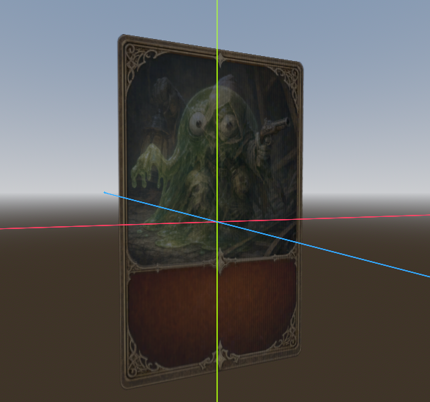
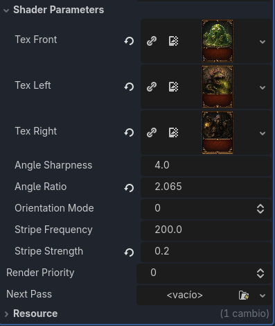

# Lenticular Angle‑Blend Shader — Technical Overview

This document explains the behavior, purpose, and parameters of a custom Godot shader designed for **lenticular‑style texture switching** based on camera angle. It focuses on how the shader blends between multiple textures, how angle weighting works, and how artists can control orientation, sharpness, and stripe direction.

[View Code](lenticular_card.gdshader)

---

## What This Shader Does

This shader creates a **lenticular effect**, where different textures become visible depending on the viewer’s angle. It supports:

- **Three‑way angle‑based blending** (front, left, right)
- **Configurable angle sharpness** for soft or hard transitions
- **Angle ratio control** to shift where transitions occur
- **Vertical or horizontal lenticular stripes**
- **Orientation toggle** for both angle detection and stripe direction
- **Clean, normalized blending** with no popping or harsh edges

This makes it ideal for **holograms, animated billboards, lenticular cards, stylized VFX, and angle‑dependent sprites**.

---

## How the Shader Works (Conceptual Breakdown)

### 1. View Direction in Local Space
The shader computes the camera direction relative to the object:

- Converts world‑space view vector into local space  
- Ensures angle detection works regardless of object rotation  
- Allows consistent behavior for any mesh orientation  

This gives a stable basis for angle‑dependent blending.

---

### 2. Angle Extraction
The shader uses `atan(a, b)` to compute a signed angle:

- For **vertical mode**: angle is based on left/right (x vs z)
- For **horizontal mode**: angle is based on up/down (y vs z)

This angle determines which texture should be most visible.

---

### 3. Angle Ratio (Artist Control)
A multiplier (`angle_ratio`) remaps the angle range:

- Compresses or expands the angle response  
- Moves transition zones earlier or later  
- Allows fine‑tuning of how the lenticular effect behaves  

This gives full control over *where* textures switch.

---

### 4. Weight Calculation
Each texture receives a weight based on:

- Distance from its ideal angle  
- Sharpness exponent (`angle_sharpness`)  
- Normalized sum to avoid brightness changes  

This produces smooth, stable blending.

---

### 5. Lenticular Stripes
A sine‑wave stripe pattern simulates lenticular ridges:

- Uses UV.x for vertical stripes  
- Uses UV.y for horizontal stripes  
- Strength and frequency are adjustable  

Stripes subtly modulate brightness to enhance the effect.

---

### 6. Orientation Mode
A single uniform (`orientation_mode`) controls:

- Whether stripes run vertically or horizontally  
- Whether angle detection uses left/right or up/down  

This makes the shader flexible for many use cases.

---

## Parameter Reference

| Parameter | Description | Artistic Use |
|----------|-------------|--------------|
| **angle_sharpness** | Controls hardness of texture transitions | Soft blend vs. hard snap |
| **angle_ratio** | Remaps angle range | Shift where textures switch |
| **orientation_mode** | 0 = vertical, 1 = horizontal | Choose effect direction |
| **stripe_frequency** | Density of lenticular lines | Fine or coarse ridges |
| **stripe_strength** | Visibility of stripes | Subtle or strong modulation |
| **tex_front / tex_left / tex_right** | Input textures | Main lenticular images |

---

## What You Can Achieve With This Shader

### **Holograms & Sci‑Fi Displays**
Angle‑dependent switching creates futuristic UI elements.

### **Lenticular Cards & Posters**
Simulates real‑world lenticular printing effects.

### **Stylized VFX**
Combine stripes and angle blending for magical or surreal looks.

### **Billboards & Signs**
Show different images depending on viewing direction.

### **Character Portraits**
Switch expressions or states based on camera angle.

---

## Summary

This shader provides a flexible, artist‑friendly system for **angle‑based texture blending**. With:

- Local‑space angle detection  
- Adjustable sharpness and ratio  
- Orientation toggles  
- Lenticular stripe simulation  

…it becomes a powerful tool for creating **dynamic, angle‑reactive visuals** in Godot.

