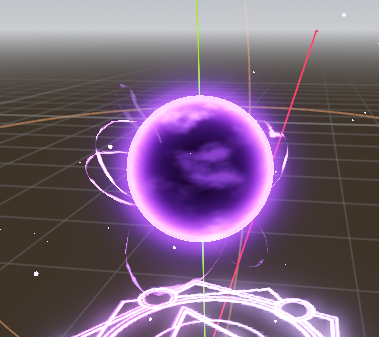
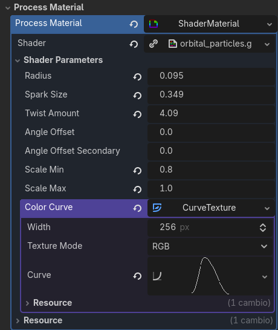

# Radial Particle Orientation Shader — Technical Overview

This document explains the behavior, purpose, and parameters of a custom Godot GPU particle shader designed for **radial, outward‑facing particle effects**. It focuses on what the shader achieves, how it operates internally, and how each parameter influences the final visual result.

[View Code](orbital_particles.gdshader)

---

## What This Shader Does

This shader generates particles that:

- **Spawn uniformly across a sphere**, not clustered or biased toward poles.
- **Face outward from the emitter center**, creating a clean radial orientation.
- **Maintain a stable per‑particle scale**, ensuring consistent size throughout their lifetime.
- **Apply random twist rotation** for natural variation.
- **Allow manual angular offsets**, giving the artist control over sprite rotation and tilt.
- **Use a color/alpha curve** to animate appearance over lifetime.

The result is a highly flexible system for creating **explosions, sparks, magical bursts, energy flares, embers, and stylized radial VFX**.

---

## How the Shader Works (Conceptual Breakdown)

### 1. Uniform Spherical Distribution
Each particle is assigned a random direction on a sphere using spherical coordinates. This ensures:

- Even distribution  
- No clumping  
- Perfect radial symmetry  

The direction is stored per particle and reused every frame.

---

### 2. Stable Per‑Particle Scale
A random scale is generated once at particle birth and stored. This avoids:

- Flickering  
- Frame‑to‑frame randomness  
- CPU‑side randomization  

This scale is applied to the particle’s orientation basis.

---

### 3. Radial Positioning
Particles are positioned at a fixed distance (`radius`) from the emitter center:

- Creates a hollow sphere  
- Useful for shockwaves, bursts, and magical pulses  

---

### 4. Orientation Basis Construction
The shader builds a custom 3D basis for each particle:

- **Forward** → the particle’s radial direction  
- **Right** → perpendicular to forward  
- **Up** → perpendicular to both  

This ensures the particle quad always faces outward.

---

### 5. Random Twist Rotation
A random rotation is applied around the forward axis:

- Adds natural variation  
- Prevents all quads from looking identical  
- Controlled by `twist_amount`  

---

### 6. Angular Offsets (Artist Controls)
Two user‑controlled rotations are applied:

#### **Primary Offset (`angle_offset`)**
- Rotates the quad around its forward axis  
- Useful for aligning textures or rotating sparks  

#### **Secondary Offset (`angle_offset_secondary`)**
- Rotates around the right axis  
- Adds tilt or directional bias  
- Useful for shaping flares or stylized effects  

These offsets give the artist precise control over particle orientation.

---

### 7. Color and Alpha Over Lifetime
A color ramp texture (`color_curve`) is sampled using the particle’s normalized lifetime:

- Fade in/out  
- Glow pulses  
- Color transitions  
- Heat‑to‑cool effects  

This is essential for polished VFX.

---

## Parameter Reference

| Parameter | Description | Artistic Use |
|----------|-------------|--------------|
| **radius** | Distance from emitter center | Explosion radius, shockwave size |
| **spark_size** | Base size of each particle quad | Global scale control |
| **twist_amount** | Random rotation around forward axis | Adds variation and chaos |
| **angle_offset** | Manual rotation around forward | Texture alignment, spin |
| **angle_offset_secondary** | Rotation around right axis | Tilt, flare shaping |
| **scale_min / scale_max** | Range for random per‑particle scale | Size variation |
| **color_curve** | Lifetime color/alpha texture | Fade, glow, color transitions |

---

## What You Can Achieve With This Shader

### **Explosions & Shockwaves**
Perfect radial distribution and outward‑facing quads create clean, cinematic bursts.

### **Magic Bursts & Energy Pulses**
Angular offsets allow stylized, directional, or spiral‑like effects.

### **Sparks, Embers, and Fire Particles**
Random scale and twist add natural variation.

### **Flares & Light Rays**
Secondary offset tilts quads to create star‑shaped or radial flare patterns.

### **Auras & Magical Spheres**
Uniform spherical distribution creates glowing shells or halos.

### **Stylized VFX**
Combining offsets, twist, and color curves enables unique artistic looks.

---

## Summary

This shader is a powerful tool for creating **high‑quality radial particle effects** in Godot. It combines:

- Physically coherent orientation  
- Artistic rotation controls  
- GPU‑driven randomness  
- Lifetime‑based color animation  

The result is a flexible, efficient system suitable for everything from realistic sparks to stylized magical effects.

